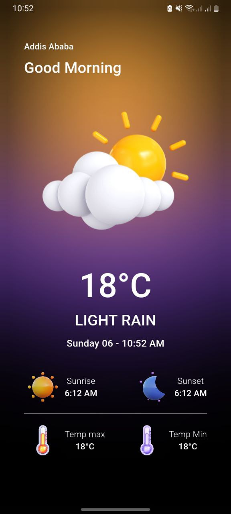

# Weather App
This is a weather app built using Flutter and BLoC for state management. The app fetches the user's current location and displays weather data based on it. The data includes temperature, weather conditions, sunrise and sunset times, and more. The UI features a dynamic and responsive design with custom graphics.

## Features
- Fetches current weather based on the device's location.
- Displays:
    - Temperature (in Celsius)
    - Weather description
    - Sunrise and sunset times
    - Maximum and minimum temperatures
- Handles errors, such as denied location permissions.
- A modern and minimalistic UI with custom circular design elements.
## Dependencies
- flutter_bloc: For BLoC pattern implementation and state management.
- geolocator: For fetching the current location of the device.
- intl: For formatting dates and times.
- material: Flutter's default UI toolkit.
## Getting Started
### Prerequisites
Make sure you have Flutter installed. If not, you can follow the official installation guide.

### Installation
1. Clone the repository:

```
git clone https://github.com/your-username/weather_app.git
```
2. Navigate to the project directory:

```
cd weather_app
```
3. Install the required packages:
```
flutter pub get
```
### Running the App
To run the app on an emulator or physical device:

```
flutter run
```
## How It Works
- Main File (main.dart): This initializes the app, determines the user's current position using the Geolocator package, and handles location permission logic. If location permissions are granted, the app triggers the BLoC to fetch the weather data using the provided location.

- Home Screen (home_screen.dart): Displays the weather information with a clean and modern design. The BlocBuilder listens for changes in the WeatherState and updates the UI accordingly. The weather conditions determine which icons and data to show.

## BLoC
The app follows the BLoC (Business Logic Component) pattern to separate business logic from the UI. The BLoC listens for weather events, fetches the weather data based on location, and updates the UI when data is available.

## Future Improvements
- Implement a search feature to allow users to manually enter a city or location.
- Add more detailed weather data such as humidity, wind speed, etc.
- Provide forecast data for multiple days.
- Improve error handling and user feedback mechanisms.
- Add dark/light theme support.


